 
<div align="center">

# 🎓 WEDDONG QUIZ V2

### ⚡ SMART CLASSROOM · REAL-TIME QUIZ · IoT INTERACTION

**Hệ thống thi trắc nghiệm tương tác thời gian thực tích hợp Web và thiết bị ESP32**

Một giải pháp giúp giáo viên tổ chức lớp học tương tác, quản lý câu hỏi và theo dõi kết quả trực tiếp, kết nối đồng bộ giữa **giáo viên – học sinh – màn hình lớp – thiết bị phần cứng**.

[](https://react.dev/)
[](https://vite.dev/)
[](https://nodejs.org/)
[](https://www.espressif.com/)
[](https://mqtt.org/)


**🎯 Interactive Learning | 🌐 Real-Time Communication | 🎛️ Smart Hardware**

</div>

---

## 🌟 01. GIỚI THIỆU DỰ ÁN

**WEDDONG QUIZ V2** là nền tảng thi trắc nghiệm thời gian thực dành cho môi trường lớp học, kết hợp công nghệ Web với hệ thống phần cứng IoT.

Thay vì chỉ trả lời câu hỏi trên điện thoại hoặc máy tính, học sinh có thể sử dụng **thiết bị ESP32 với bàn phím vật lý** để tham gia và gửi đáp án.

Hệ thống sử dụng **Socket.IO** để đồng bộ giao diện và **MQTT** để giao tiếp với thiết bị phần cứng.

### 🎯 Mục tiêu phát triển

- 📚 Xây dựng môi trường học tập tương tác và trực quan.
- ⚡ Đồng bộ câu hỏi, đáp án và kết quả theo thời gian thực.
- 🎮 Kết hợp phần mềm Web với thiết bị trả lời vật lý.
- 📊 Hỗ trợ giáo viên quản lý lớp và đánh giá kết quả.
- 🔌 Ứng dụng công nghệ IoT vào hoạt động giáo dục.

---

## 🎮 02. CÁC THÀNH PHẦN HỆ THỐNG

| Thành phần | Vai trò | Chức năng |
|---|---|---|
| 👩‍🏫 **Admin Dashboard** | Giáo viên | Tạo phòng, nạp đề, phát/chốt câu hỏi, xem kết quả |
| 🧑‍🎓 **Web Player** | Học sinh | Tham gia bằng PIN và STT, chọn đáp án A–D |
| 🖥️ **Audience Screen** | Màn hình lớp | Hiển thị sảnh chờ, câu hỏi và kết quả |
| 🎛️ **ESP32 Controller** | Thiết bị IoT | Check-in, chọn và gửi đáp án bằng bàn phím |
| 🗄️ **Backend Server** | Máy chủ | Xử lý nghiệp vụ, giao tiếp thời gian thực và lưu trữ |

### 🔗 Đường dẫn giao diện

| Giao diện | URL |
|---|---|
| 👩‍🏫 Giáo viên | `/admin` |
| 🧑‍🎓 Học sinh | `/play` |
| 🖥️ Màn hình trình chiếu | `/screen` |
| 💚 Backend Health Check | `/api/health` |

---

## ✨ 03. TÍNH NĂNG NỔI BẬT

### ⚡ Real-Time Synchronization

- Đồng bộ giữa giáo viên, học sinh và màn hình lớp.
- Cập nhật trạng thái câu hỏi bằng Socket.IO.
- Hiển thị kết quả ngay sau khi giáo viên chốt.

### 🎛️ ESP32 Hardware Integration

- Thiết bị trả lời độc lập qua Wi-Fi và MQTT.
- Bàn phím vật lý gồm 12 nút.
- Hỗ trợ nhập STT, lựa chọn và gửi đáp án.
- LED báo trạng thái hoạt động.

### 📝 Smart Quiz Management

- Tạo phòng thi với mã PIN.
- Nạp danh sách học sinh và bộ câu hỏi.
- Cho phép thay đổi đáp án trước khi chốt.
- Chỉ ghi nhận đáp án cuối cùng để chấm điểm.
- Quản lý kết quả và trạng thái phiên thi.

### 🛡️ System Management

- Bảo vệ API quản trị bằng mật khẩu và token.
- Lưu trữ dữ liệu bằng MySQL.
- Khôi phục trạng thái câu hỏi đang diễn ra khi backend khởi động lại.
- Hỗ trợ nhiều loại thiết bị truy cập.

---

## 🏗️ 04. KIẾN TRÚC HỆ THỐNG

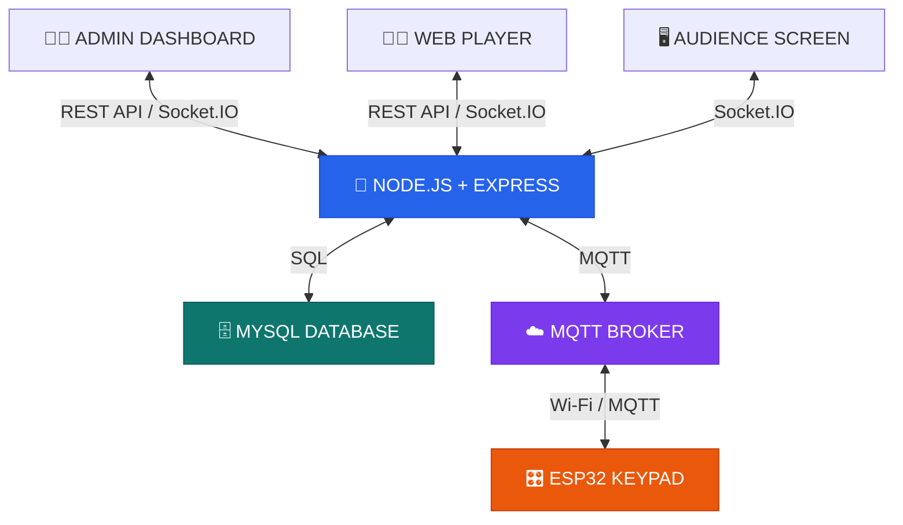
```mermaid
flowchart TB
    A["👩‍🏫 ADMIN DASHBOARD"]
    B["🧑‍🎓 WEB PLAYER"]
    C["🖥️ AUDIENCE SCREEN"]
    D["🚀 NODE.JS + EXPRESS"]
    E["🗄️ MYSQL DATABASE"]
    F["☁️ MQTT BROKER"]
    G["🎛️ ESP32 KEYPAD"]

    A <-->|REST API / Socket.IO| D
    B <-->|REST API / Socket.IO| D
    C <-->|Socket.IO| D
    D <-->|SQL| E
    D <-->|MQTT| F
    F <-->|Wi-Fi / MQTT| G

    style D fill:#2563eb,color:#fff,stroke:#1d4ed8
    style E fill:#0f766e,color:#fff,stroke:#115e59
    style F fill:#7c3aed,color:#fff,stroke:#6d28d9
    style G fill:#ea580c,color:#fff,stroke:#c2410c
```

### 🔄 Nguyên lý hoạt động

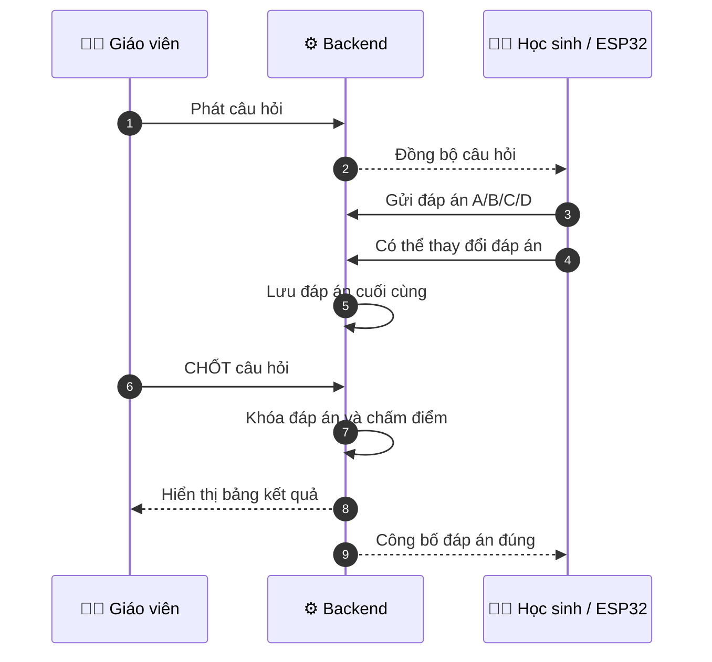
```mermaid
sequenceDiagram
    autonumber
    participant GV as 👩‍🏫 Giáo viên
    participant BE as ⚙️ Backend
    participant HS as 🧑‍🎓 Học sinh / ESP32

    GV->>BE: Phát câu hỏi
    BE-->>HS: Đồng bộ câu hỏi
    HS->>BE: Gửi đáp án A/B/C/D
    HS->>BE: Có thể thay đổi đáp án
    BE->>BE: Lưu đáp án cuối cùng
    GV->>BE: CHỐT câu hỏi
    BE->>BE: Khóa đáp án và chấm điểm
    BE-->>GV: Hiển thị bảng kết quả
    BE-->>HS: Công bố đáp án đúng
```

**Nguyên tắc quan trọng:** Hệ thống không chấm ngay khi học sinh nhấn nút. Đáp án được ghi nhận và chỉ được chấm sau khi giáo viên thực hiện thao tác **CHỐT**.

---

## 🎨 05. THIẾT KẾ PHẦN CỨNG

### 🎛️ Thiết bị trả lời ESP32

Thiết bị được phát triển nhằm tạo ra một bộ điều khiển trả lời trắc nghiệm nhỏ gọn, dễ sử dụng và giao tiếp không dây với hệ thống Web.

**Các thành phần thiết kế:**

- ESP32 làm bộ xử lý trung tâm.
- Bàn phím vật lý 12 nút.
- Kết nối Wi-Fi thông qua MQTT.
- Đèn LED báo trạng thái.
- PCB thiết kế riêng.
- Vỏ hộp 3D phục vụ lắp ráp.

### 🧊 5.1. Mẫu vỏ hộp in 3D

<div align="center">

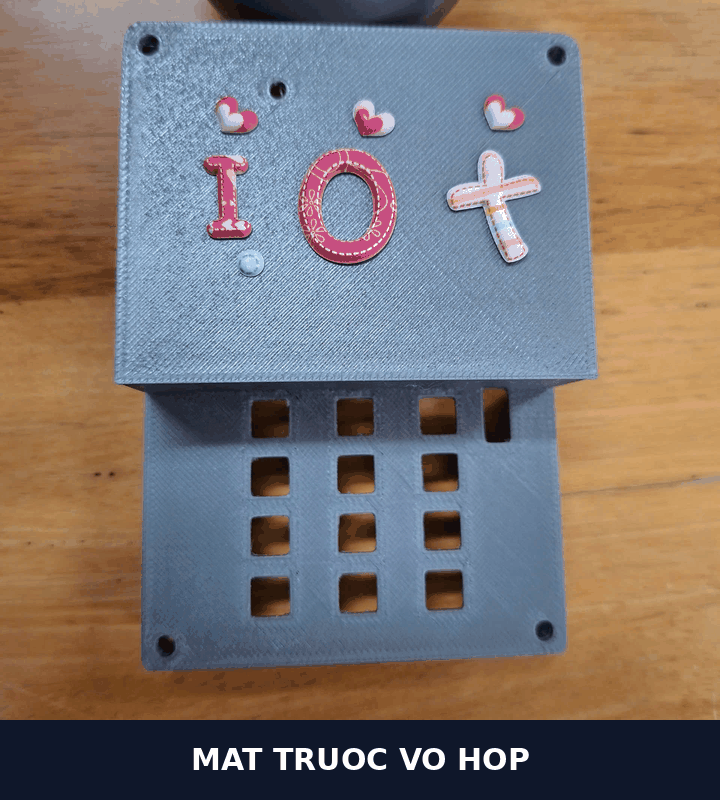

*🎞️ Các góc nhìn của mẫu vỏ hộp thử nghiệm*

</div>

> **Prototype:** Đây là mẫu vỏ hộp in 3D thử nghiệm, chưa lắp bo mạch và linh kiện điện tử bên trong.

<table>
<tr>
<td align="center" width="33%">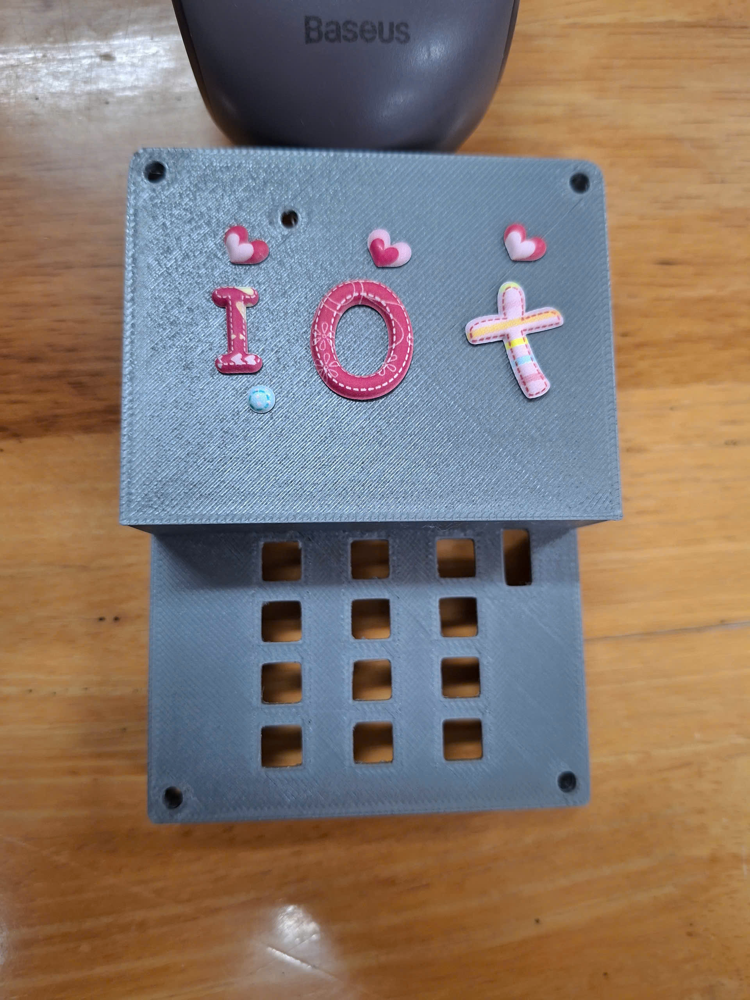<br><b>🎛️ Mặt trước</b></td>
<td align="center" width="33%">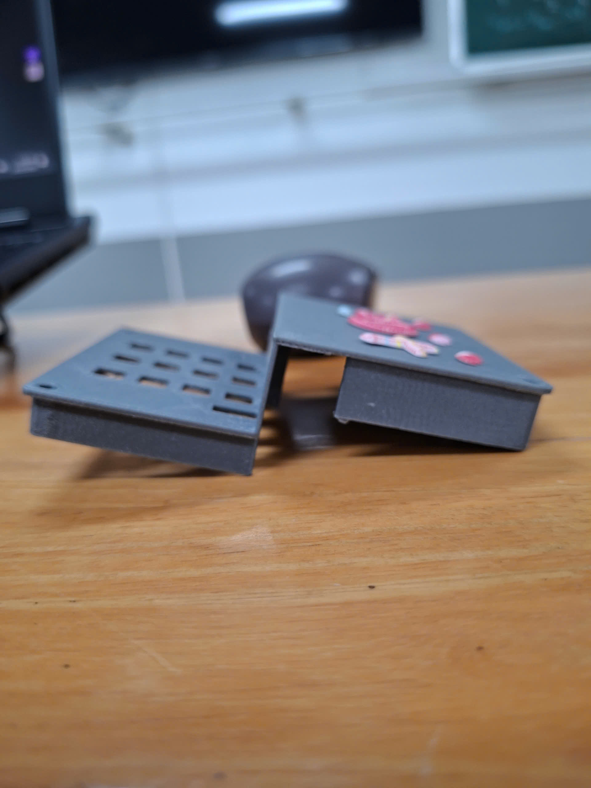<br><b>🧩 Các chi tiết</b></td>
<td align="center" width="33%">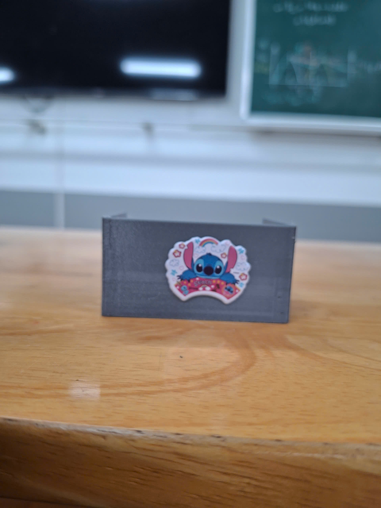<br><b>📦 Vỏ ngoài</b></td>
</tr>
<tr>
<td align="center">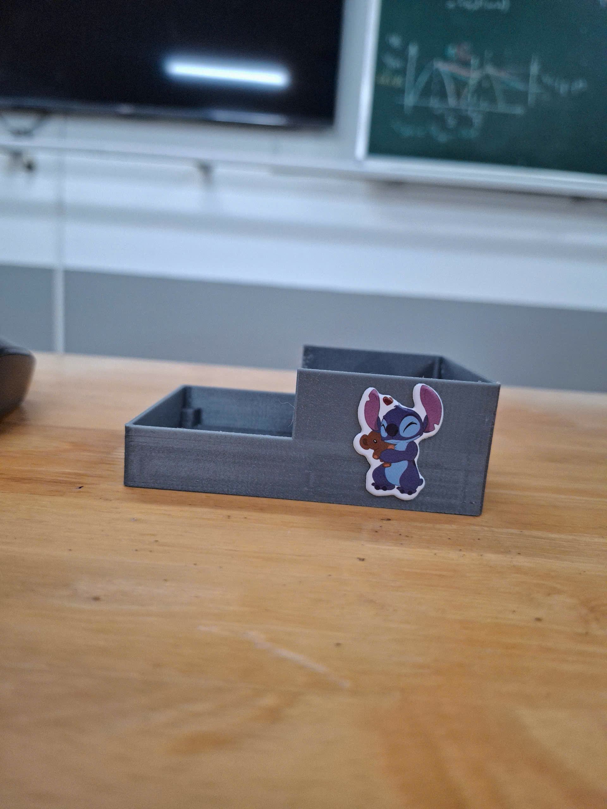<br><b>📐 Góc nhìn bên</b></td>
<td align="center">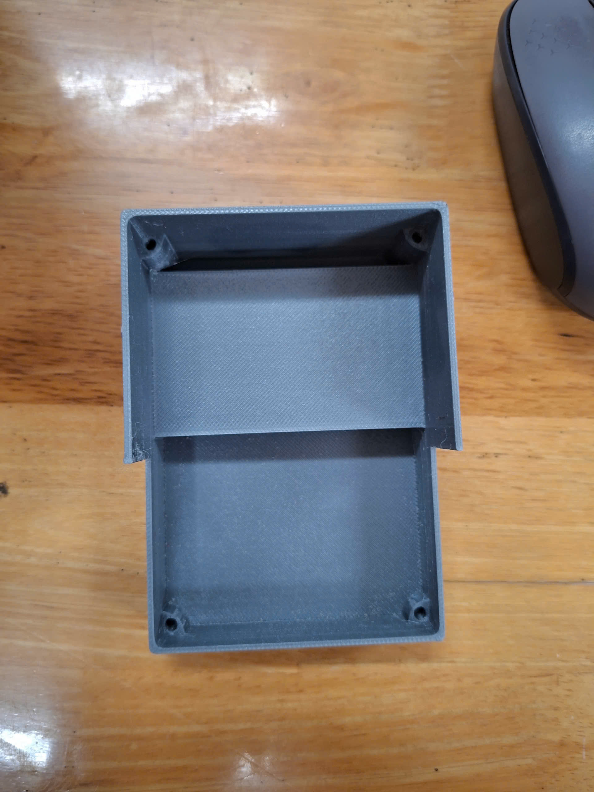<br><b>🔧 Khoang bên trong</b></td>
<td align="center">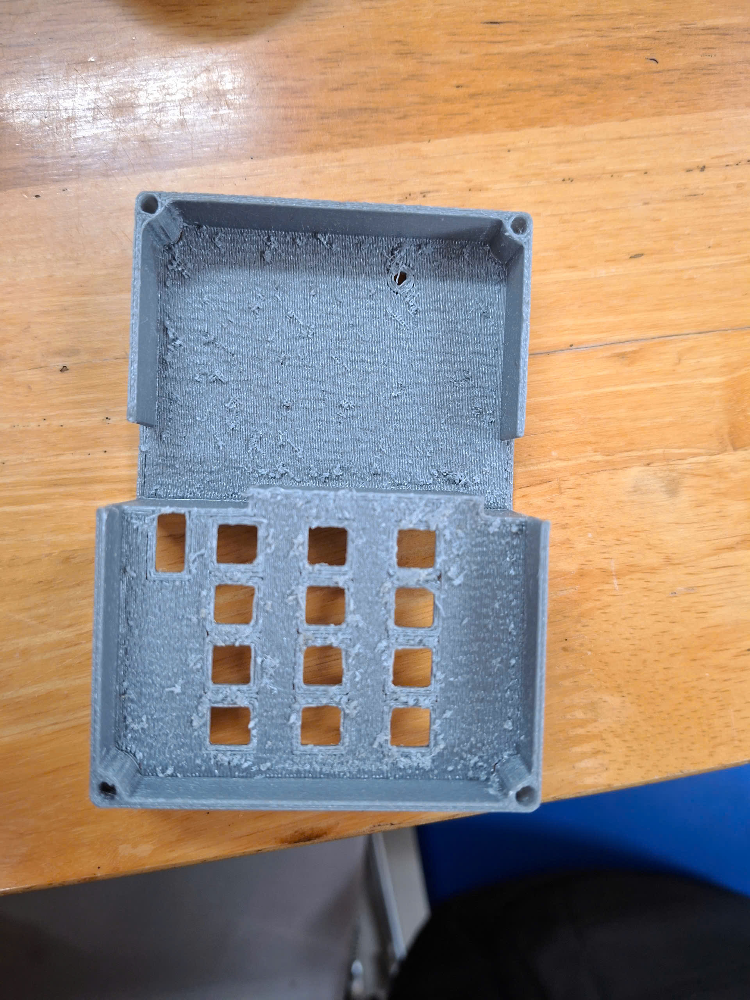<br><b>🔩 Mặt trong nắp</b></td>
</tr>
</table>

### 🔌 5.2. Thiết kế PCB

**PCB ESP32 Keypad – Kích thước 60 × 90 mm**

<table>
<tr>
<td align="center" width="50%">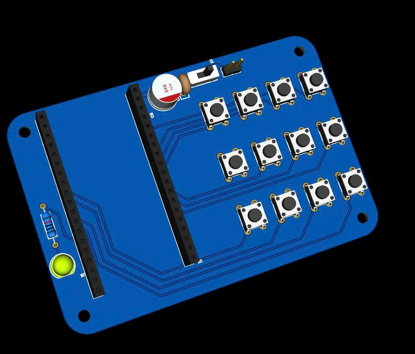<br><b>PCB 3D – Top View</b></td>
<td align="center" width="50%">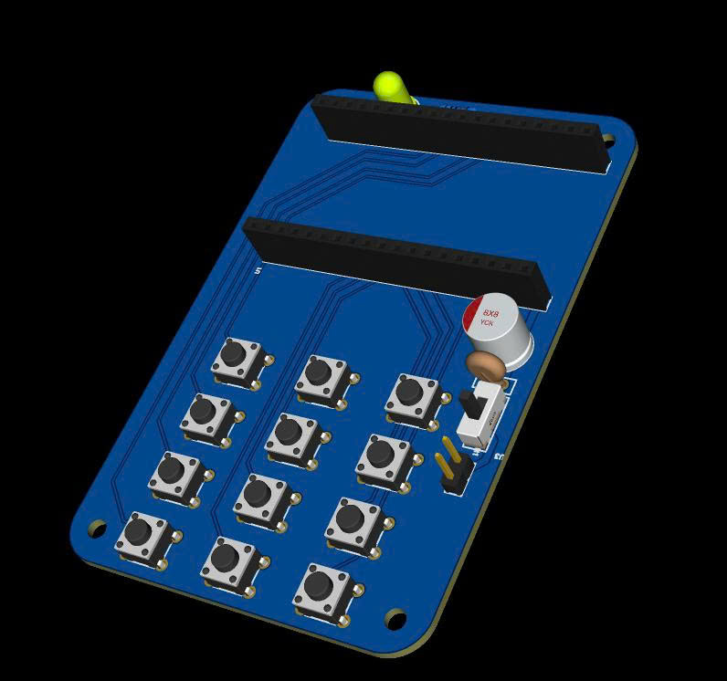<br><b>PCB 3D – Perspective</b></td>
</tr>
<tr>
<td align="center">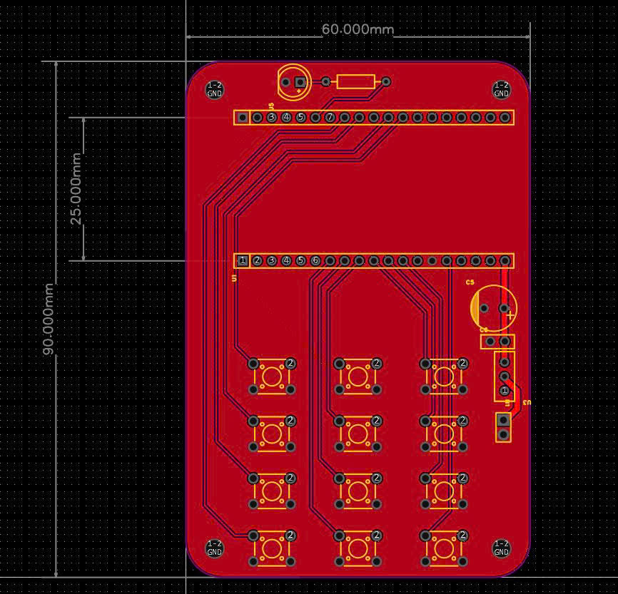<br><b>PCB Layout – Front</b></td>
<td align="center">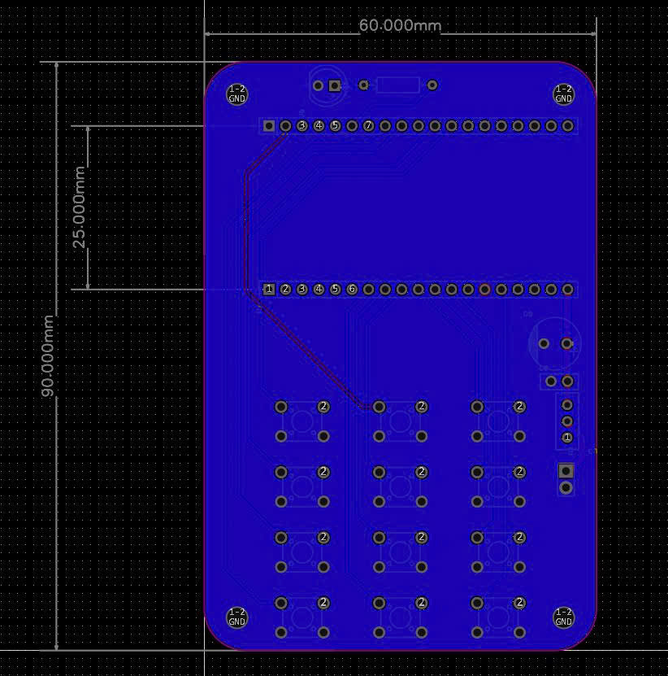<br><b>PCB Layout – Back</b></td>
</tr>
</table>

<details>
<summary><b>🔍 Xem thêm hình ảnh thiết kế phần cứng</b></summary>

<br>

<table>
<tr>
<td align="center" width="33%">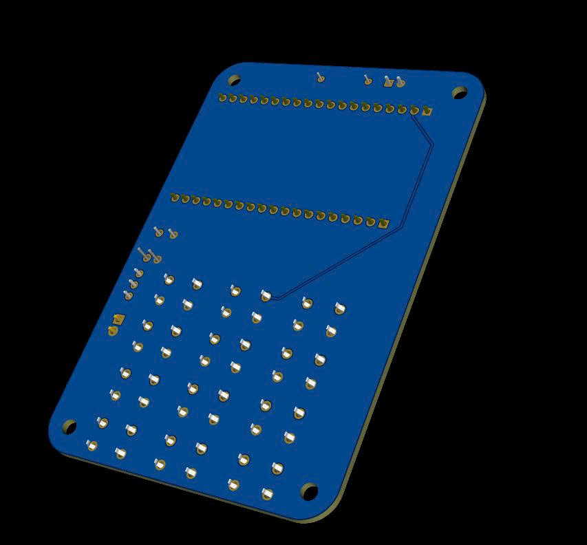<br><b>PCB Bottom</b></td>
<td align="center" width="33%">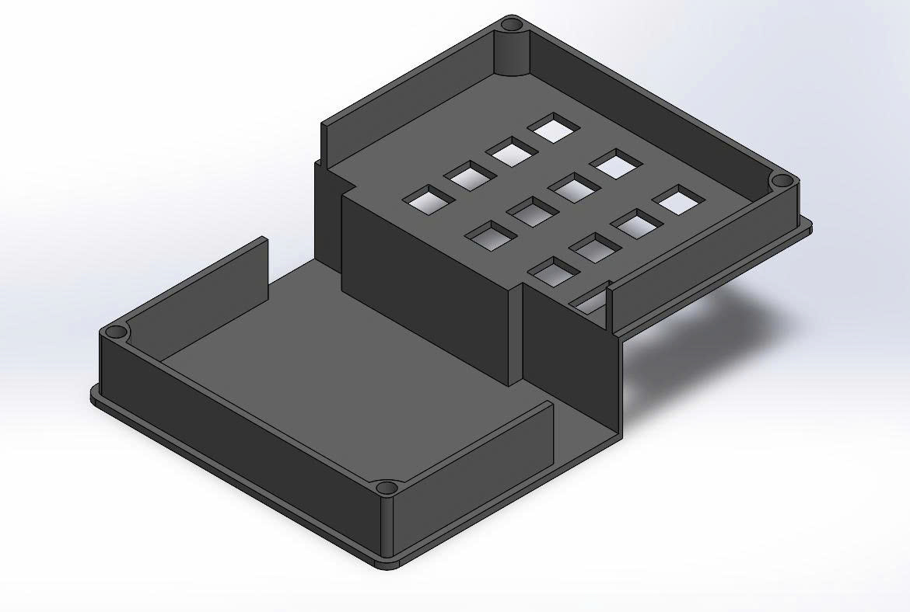<br><b>Enclosure 3D</b></td>
<td align="center" width="33%">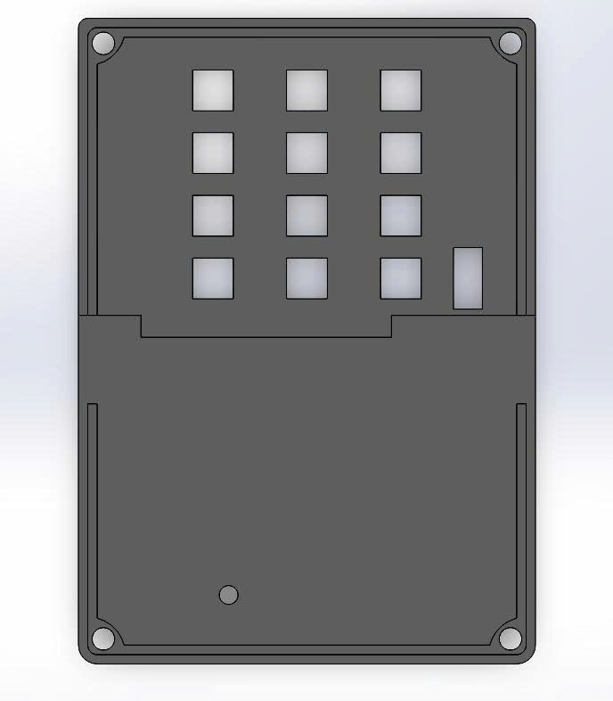<br><b>Enclosure Top</b></td>
</tr>
</table>

</details>

### ⌨️ 5.3. Sơ đồ chân ESP32

| Nút nhấn | GPIO | Chế độ nhập STT | Chế độ trả lời |
|:---:|:---:|---|---|
| `1` | 16 | Nhập số 1 | A |
| `2` | 23 | Nhập số 2 | B |
| `3` | 26 | Nhập số 3 | C |
| `4` | 17 | Nhập số 4 | D |
| `5` | 25 | Nhập số 5 | — |
| `6` | 27 | Nhập số 6 | — |
| `7` | 18 | Nhập số 7 | — |
| `8` | 33 | Nhập số 8 | — |
| `9` | 14 | Nhập số 9 | — |
| `0` | 32 | Nhập số 0 | — |
| `*` RESET | 19 | Xóa STT | Rời phiên, nhập lại STT |
| `#` ENTER | 13 | Xác nhận STT | Gửi đáp án |
| LED | 21 | Báo kết nối | Báo trạng thái trả lời |

---

## 🧰 06. TECHNOLOGY STACK

| Layer | Technologies | Purpose |
|---|---|---|
| 🎨 Frontend | React 19, Vite 8, Tailwind CSS | Giao diện người dùng |
| 🧭 Routing | React Router | Điều hướng |
| ⚙️ Backend | Node.js, Express 5 | REST API và xử lý nghiệp vụ |
| ⚡ Real-Time | Socket.IO | Đồng bộ trạng thái |
| 🗄️ Database | MySQL | Lưu trữ dữ liệu |
| 🎛️ Embedded | ESP32, Arduino | Thiết bị trả lời |
| ☁️ IoT Protocol | MQTT, PubSubClient | Giao tiếp phần cứng |
| 📡 Broker | EMQX Public Broker | Trung gian MQTT |
| 🚀 Deployment | Netlify, Render | Nền tảng triển khai gợi ý |

---

## 🚀 07. INSTALLATION & QUICK START

### 7.1. Yêu cầu hệ thống

- Node.js phiên bản 20 trở lên.
- npm.
- MySQL Server.
- Git.
- Arduino IDE và thư viện PubSubClient nếu sử dụng ESP32.

### 7.2. Clone repository

```bash
git clone https://github.com/USERNAME/WEDDONG-QUIZ.git
cd WEDDONG-QUIZ
```

Thay `USERNAME` bằng tài khoản GitHub thực tế.

### 7.3. Khởi động Backend

```bash
cd Backend

cp .env.example .env

npm ci
npm test
npm start
```

Chỉnh sửa `.env` với thông tin MySQL và cấu hình quản trị phù hợp trước khi khởi động.

**Backend URL:**

`http://localhost:3000`

**Health Check:**

`http://localhost:3000/api/health`

### 7.4. Khởi động Frontend

Mở terminal mới:

```bash
cd frontend/frontend

npm ci
npm run dev
```

**Frontend URL:**

`http://localhost:5173`

### 7.5. Truy cập bằng điện thoại

Máy tính và điện thoại cần kết nối cùng mạng Wi-Fi.

Xác định IP máy chủ Ubuntu:

```bash
hostname -I
```

Nếu Vite chỉ lắng nghe trên localhost, chạy:

```bash
npm run dev -- --host 0.0.0.0
```

Trên điện thoại, truy cập:

`http://IP_MAY_CHU:5173`

Đảm bảo backend và cấu hình API/Socket.IO cho phép kết nối từ thiết bị trong mạng LAN.

---

## 🧪 08. HƯỚNG DẪN KIỂM THỬ

### Bước 1 — Giáo viên tạo phòng

Truy cập `/admin`, đăng nhập và tạo phòng học mới.

### Bước 2 — Nạp danh sách học sinh

Mở **Sổ Đầu Bài**, nạp file:

`DU_LIEU_MAU/01_DANH_SACH_LOP_MAU.txt`

### Bước 3 — Nạp bộ câu hỏi

Mở **Nạp câu hỏi**, sử dụng:

`DU_LIEU_MAU/02_DE_MAU_RTOS_10_CAU.txt`

### Bước 4 — Mở màn hình lớp

Truy cập:

`/screen?pin=<MA_PIN>`

### Bước 5 — Học sinh tham gia

Học sinh vào `/play`, nhập mã PIN và STT hoặc check-in bằng ESP32.

### Bước 6 — Bắt đầu phiên thi

Giáo viên phát câu hỏi, học sinh gửi đáp án và giáo viên nhấn **CHỐT** để khóa, chấm điểm và công bố kết quả.

---

## 📂 09. PROJECT STRUCTURE

```text
WEDDONG_QUIZ_V2_FULL/
│
├── Backend/
│   └── REST API, Socket.IO, MQTT, MySQL
│
├── frontend/
│   └── frontend/
│       └── React + Vite Application
│
├── ESP32/
│   └── Arduino Firmware
│
├── DU_LIEU_MAU/
│   └── Dữ liệu lớp, đề thi và thiết bị
│
├── docs/
│   └── images/
│       ├── prototype/
│       ├── PCB Images
│       └── Enclosure Images
│
├── CHAY_WEB_CUNG_WIFI.md
├── README_HUONG_DAN_CHAY.md
├── HUONG_DAN_CAP_NHAT.txt
│
└── README.md
```

---

## 📚 10. DOCUMENTATION

| Tài liệu | Nội dung |
|---|---|
| [📘 Hướng dẫn cài đặt](README_HUONG_DAN_CHAY.md) | Cài đặt và kiểm thử hệ thống |
| [📡 Chạy cùng Wi-Fi](CHAY_WEB_CUNG_WIFI.md) | Truy cập Web qua mạng LAN |
| [🔄 Hướng dẫn cập nhật](HUONG_DAN_CAP_NHAT.txt) | Cập nhật dự án |
| [📝 Dữ liệu mẫu](DU_LIEU_MAU/00_DOC_TRUOC.txt) | Danh sách lớp và đề mẫu |

---

## 🔐 11. SECURITY & LIMITATIONS

Dự án hiện phục vụ mục đích học tập, nghiên cứu và kiểm thử.

**Các lưu ý quan trọng:**

- Không đưa file `.env` và thông tin đăng nhập lên GitHub.
- Thiết lập `ADMIN_PASSWORD` và `ADMIN_TOKEN_SECRET` đủ mạnh.
- Broker MQTT công cộng chưa xác thực riêng từng thiết bị.
- Hệ thống hiện điều phối một câu hỏi MQTT đang mở tại một thời điểm.
- Nên triển khai MQTT riêng có TLS và xác thực thiết bị.
- Cần kiểm thử tải, phân quyền và sao lưu database trước khi sử dụng trong môi trường thi chính thức.

---

## 🗺️ 12. FUTURE DEVELOPMENT

Các hướng phát triển có thể mở rộng trong tương lai:

- [ ] Dashboard thống kê kết quả trực quan.
- [ ] MQTT Broker riêng hỗ trợ TLS.
- [ ] Xác thực và quản lý từng thiết bị ESP32.
- [ ] Quản lý nhiều phiên thi đồng thời.
- [ ] Phân tích kết quả học tập.
- [ ] Tối ưu giao diện trên thiết bị di động.
- [ ] Tự động hóa quy trình triển khai hệ thống.

---

## 📄 13. LICENSE

Dự án sử dụng giấy phép ISC theo khai báo trong `package.json`. Khi công bố mã nguồn, cần đảm bảo có nội dung giấy phép tương ứng.

---

<div align="center">

### 🎓 WEDDONG QUIZ V2

**Connecting Education, Software & IoT**

*Học tập tương tác · Phản hồi thời gian thực · Kết nối phần cứng*

**Made with ❤️ for Smart Classroom Innovation**

</div>
